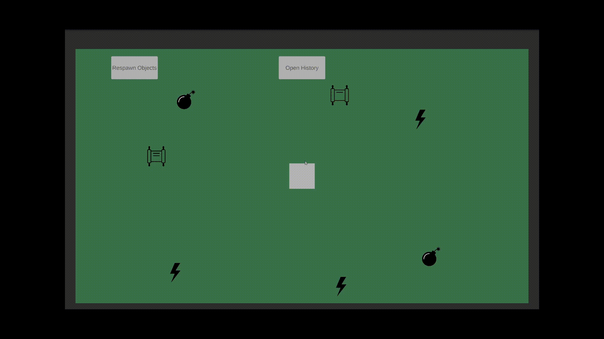
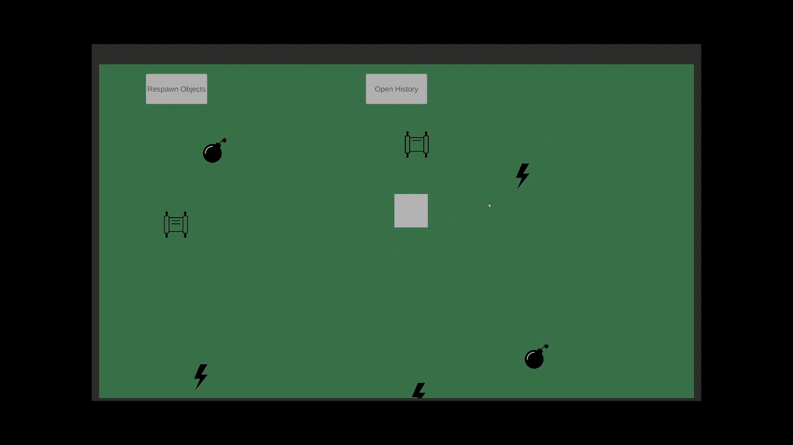
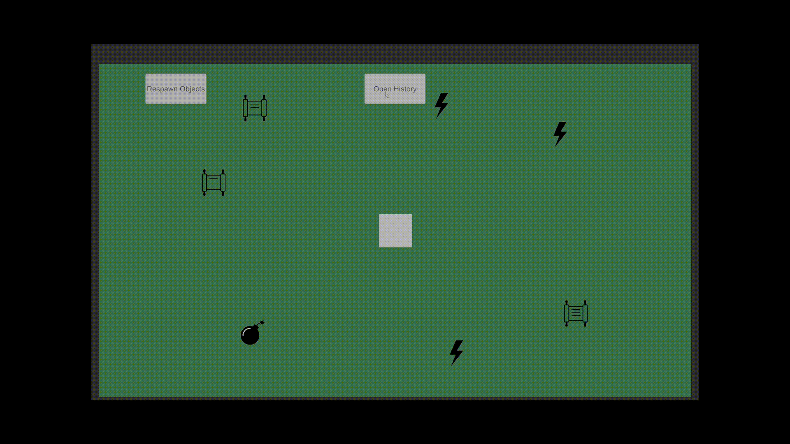
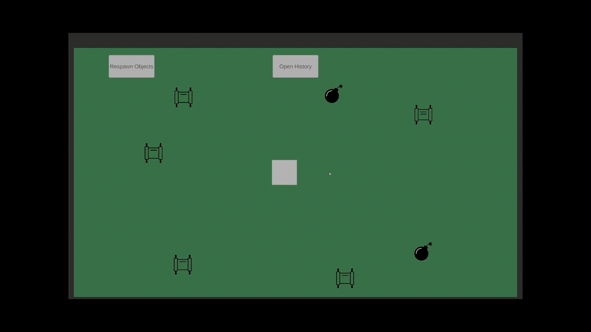

# Тестовое задание Unity Developer

Прототип, реализованный в рамках тестового задания на позицию Unity Developer.

## Описание проекта

Реализован игровой прототип с управляемым персонажем, взаимодействующим с интерактивными объектами на сцене.

Игрок перемещается по ограниченной области и может взаимодействовать с различными объектами: получать урон, временные бонусы и находить записки.

---

## Реализованный функционал

### Управление персонажем

* Передвижение с помощью **WASD**
* Поддержка **мобильного джойстика**
* Возможность переключения управления в runtime
* Ограничение передвижения персонажа реализовано через логику, без использования коллайдеров

  

### Интерактивные объекты

На сцене реализован **случайный спавн объектов** в заранее заданных точках.

#### Урон

* Уменьшает здоровье игрока
* После взаимодействия объект уничтожается
* При достижении здоровья `0` срабатывает событие окончания игры

#### Бонус

* Временно увеличивает скорость передвижения персонажа

#### Записка

* Открывает UI-окно с текстом записки
* Закрывается отдельной кнопкой

  

### Камера

* Реализовано следование камеры за персонажем
* Плавное движение камеры без использования сторонних решений

### История взаимодействий

* Ведётся **хронологическая история** взаимодействий игрока
* Реализован отдельный UI-экран с историей
* Поддерживается прокрутка списка
* История сохраняется в файловую систему в формате **JSON**
* Данные загружаются между игровыми сессиями
* Файл сохранения создается автоматически через Application.persistentDataPath

  
  

  

### UI

* Экран записок
* Экран истории взаимодействий
* Экран окончания игры
* Кнопка перезапуска сцены
* Кнопка переспавна объектов

  

---

## Управление

### Клавиатура

* **WASD** — передвижение
* **E** — взаимодействие

### UI

* **History** — открыть историю взаимодействий
* **Close** — закрыть записку / историю
* **Restart** — перезапустить игру после поражения

---

## Техническая информация

* Проект выполнен **без использования сторонних плагинов и ассетов**
* Основная логика реализована собственными средствами Unity
* Сохранение данных реализовано через файловую систему (`JSON`)
* Архитектура проекта разделена по зонам ответственности (взаимодействие, UI, история, здоровье, спавн объектов)
